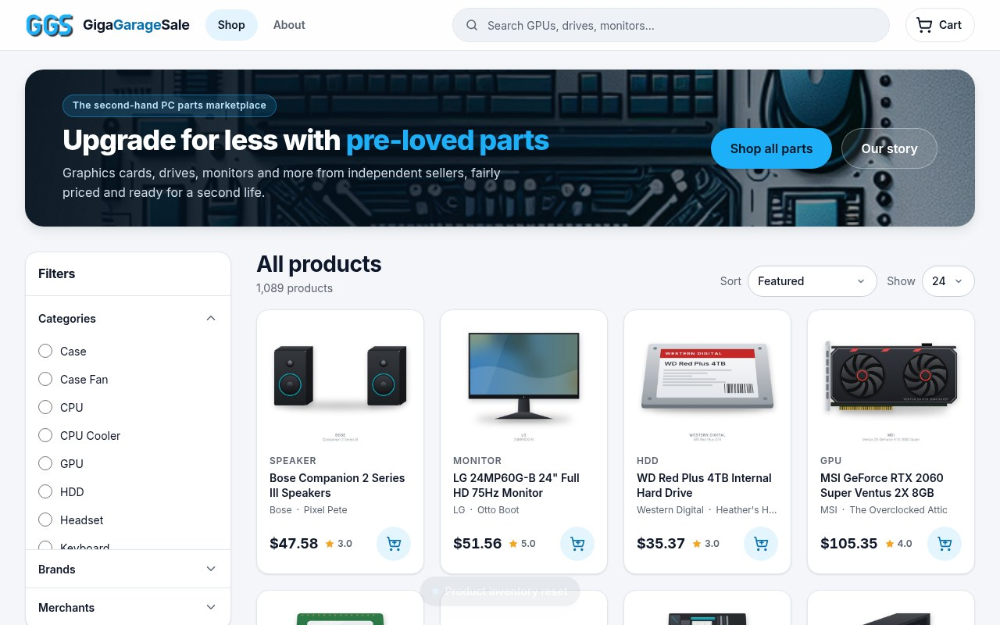

# GigaGarageSale

**Live site: [gigagaragesale.socha3.com](https://gigagaragesale.socha3.com/)**

[](https://gigagaragesale.socha3.com/)
[](https://github.com/bigmac529/GigaGarageSale/actions/workflows/deploy.yml)

A marketplace for gently used computer parts: browse, search and filter a catalog of second-hand
PC components from independent sellers, then check out from the cart. Originally built as the final
project for **SEIS622 Web Development (Spring 2025)**.

[](https://gigagaragesale.socha3.com/)

## Features

- **Catalog of 1,089 used PC parts** (ids 12-1100) across 18 categories and 30 sellers, each with a
  generated product image.
- **Server-side search, filtering, sorting and pagination.** The shop state (query, filters, sort,
  page) lives in the URL, so results can be bookmarked and shared.
- **Modern responsive UI** with automatic dark mode (follows the system setting): sticky header with
  search suggestions, filter sidebar on desktop and drawer/bottom sheet on smaller screens,
  product detail pages, and a cart with stock tracking and a demo checkout.
- **Demo reset**: "Reset demo inventory" in the footer restores every product's stock and empties
  the cart.

## Tech stack

| Folder | What's in it |
| --- | --- |
| `ui/` | Angular 19 single-page app (standalone components, SCSS, Angular Material/CDK) |
| `api/` | Express 5 + TypeScript API run with ts-node; catalog in `api/src/products.json`, images in `api/public/images/` |
| `shared/` | TypeScript interfaces used by both (`IProduct`, product page/facets) |
| `scripts/` | PowerShell deploy scripts for the Windows server |
| `.github/workflows/` | `deploy.yml`: build, test and deploy on every merge to `main` |

## Local development

Requires Node 20+. One-time install (or run `install.cmd` on Windows):

```bash
cd api && npm install
cd ../ui && npm install
```

Run the API and the UI in two terminals (or run `start.cmd` on Windows, which opens both):

```bash
# terminal 1: API on http://localhost:3106
cd api
npm start

# terminal 2: UI on http://localhost:4200
cd ui
npm start
```

`npm start` in `ui` runs `ng serve --open`, which opens http://localhost:4200/ in your browser once
the build is ready. Use `npx ng serve` if you don't want a browser window.

The UI calls the API with relative URLs (`/api/...`, `/images/...`). In production both are served
from the same site; locally `ng serve` forwards `/api` and `/images` to `http://localhost:3106` via
`ui/proxy.conf.json`, so no CORS setup is needed. The API listens on every address `localhost`
resolves to (IPv6 `::1` and IPv4 `127.0.0.1`). If you run it on another port (`PORT=...`), change
the `target` in `ui/proxy.conf.json` to match.

To try a different catalog without touching `api/src/products.json`:
`PRODUCTS_FILE=/path/to/other-products.json npm start` (in `api`).

## Tests

```bash
cd api && npm test   # Node test runner: product query/filter/pagination logic
cd ui && npm test    # Angular unit tests (Karma + Jasmine, needs Chrome)
```

## API

| Endpoint | Description |
| --- | --- |
| `GET /api/products` | Products, optionally filtered with `q` (search), `merchant`, `brand`, `category` and sorted with `sort` (`featured`, `price-asc`, `price-desc`, `rating-desc`, `title-asc`) |
| `GET /api/products?page=&pageSize=` | With `page` or `pageSize` (default 24, max 100) returns `{ items, total, page, pageSize, totalPages }`, paginated after filtering and sorting; without them, the plain array |
| `GET /api/products/facets` | Distinct merchants, brands and categories for the filter panel |
| `GET /api/products/:id` | A single product (404 if not found) |
| `POST /api/products/reset` | Reloads the catalog from disk, restoring stock (204) |
| `GET /api/health` | Health check used by CI and the deploy |

Product images are served from `/images/<id>.jpg`. In production the API also serves the built UI.

## Deployment

Every merge to `main` deploys automatically. The GitHub Actions workflow
[`.github/workflows/deploy.yml`](.github/workflows/deploy.yml) builds the UI, runs the tests,
smoke-tests the API on a GitHub-hosted runner, then hands the package to a self-hosted runner on the
Windows server, which updates the app and rolls back automatically if the health check fails. The
site runs on IIS (reverse proxy to the Node API on `localhost:3106`) behind Cloudflare at
https://gigagaragesale.socha3.com/. `main` is protected, so changes land through pull requests.

Server setup, the deploy steps, rollback and troubleshooting are in [docs/DEPLOY.md](docs/DEPLOY.md).
`scripts/post-deploy.ps1` remains for a fully manual deploy.

## Links

- Live site: https://gigagaragesale.socha3.com/
- Source: https://github.com/bigmac529/GigaGarageSale
- Michael Socha's portfolio: https://socha3.com

The site's About page tells the GigaGarageSale story and its founders, Michael Socha and Danny Xiong.
